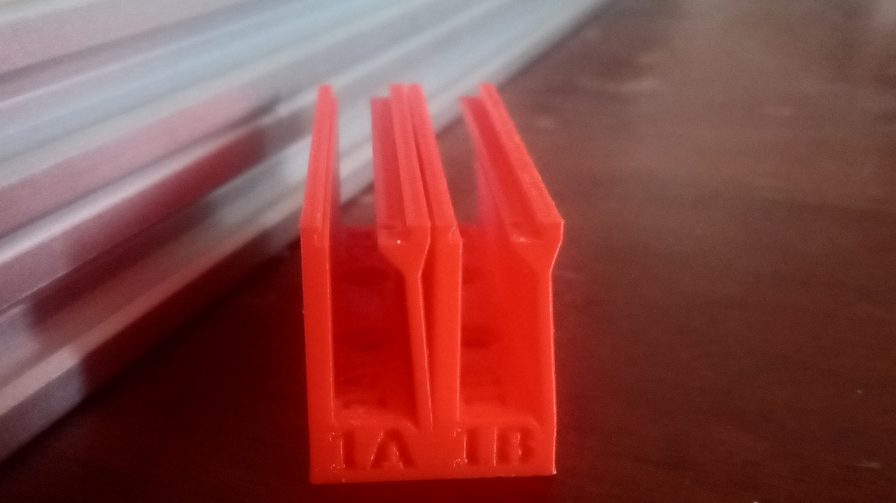
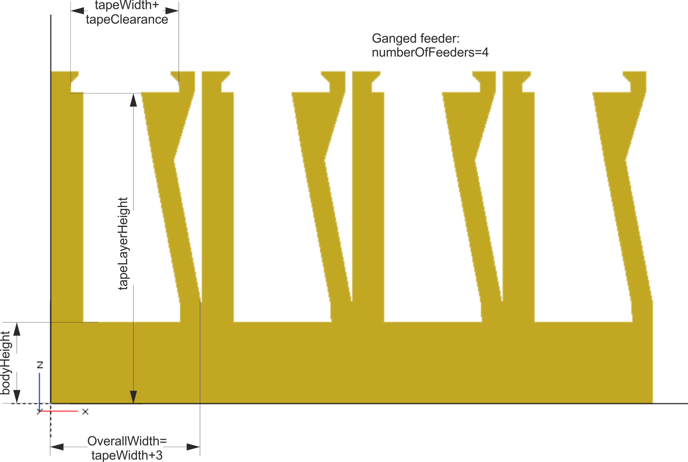
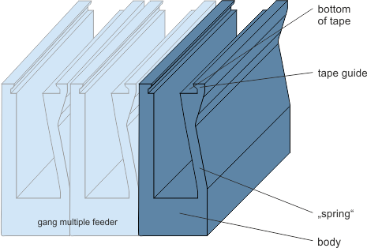
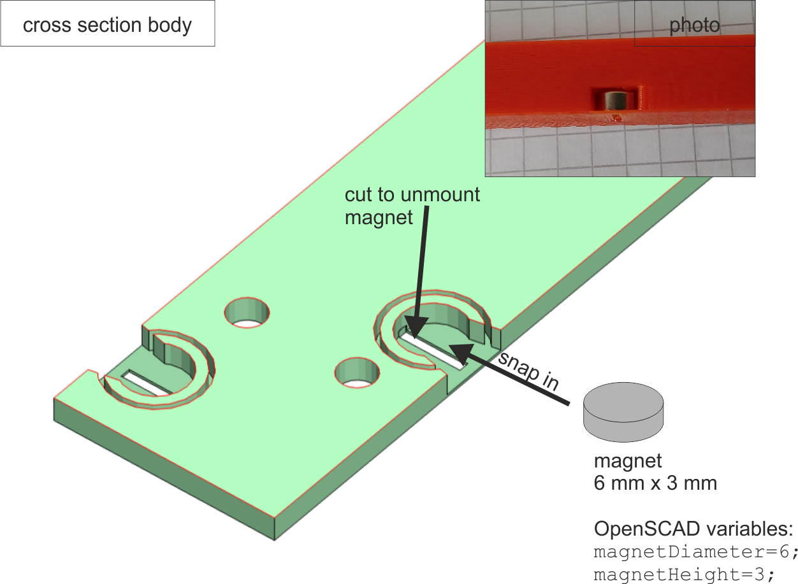
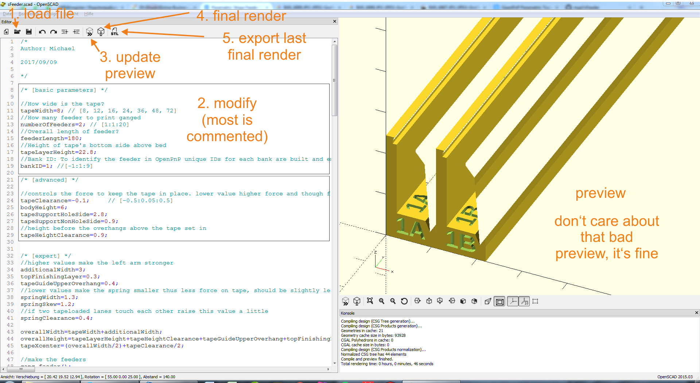
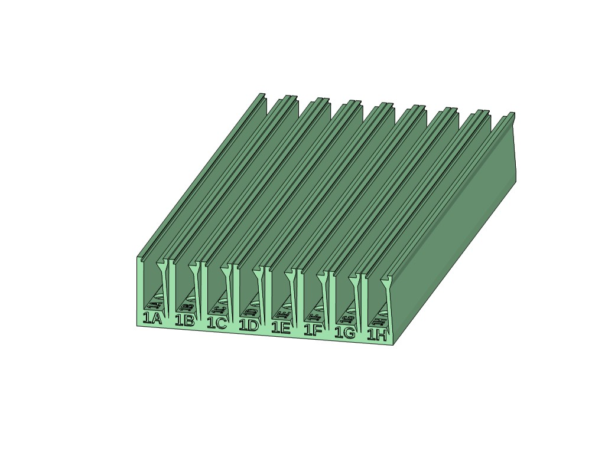
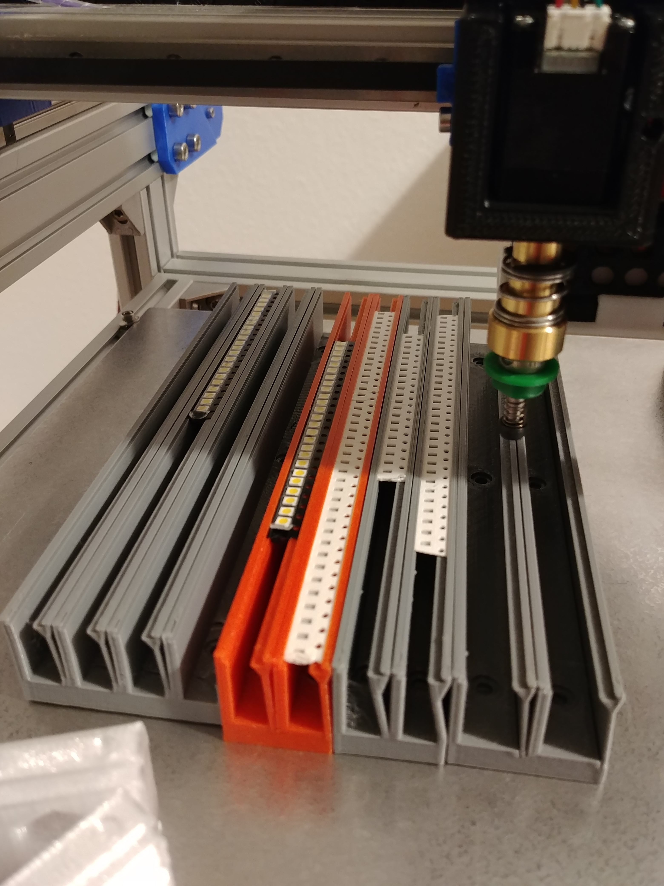

# Parametric SMT Tape Feeder

Parametric Feeder Design, load in OpenSCAD to make yours.

## What is it for?

Serves to hold SMT tapes with resistors, capacitors, etc. in place. Designed to use in a Pick and Place Machine, like [OpenPnP](http://openpnp.org/). Another option would be [this](http://malte-randt.de/strip-feeders-and-modular-tray-for-smd/).

## Features

  * parametric design fully adaptable to your needs
  * width of one feeder is tapeWidth + 3mm, eg. for 8mm tapes the feeder will be 11mm
  * gang multiple feeder in one element
  * fully 3d printable, optimized design for best print results
  * keeps tape in position by slight force causing friction
  * no vitamins needed
  * prepared to be mounted to bed by 6mmx3mm magnets or M3 screw
  * try in Thingiverse Customizer

## Print settings

|    Option    |    Value     |
| ------------ | ------------ |
| Rafts        | No           |
| Supports     | No           |
| Layer height | 0.2-0.3 [mm] |
| Nozzle size  | 0.5 [mm] max |
| Infill       | 20%          |

### Important notes

**Print in a color contrasting white paper tapes and black plastic tapes**

Before printing your feeders make a small test piece to check tolerances & more.

## Thingiverse

[thing:2506053](https://www.thingiverse.com/thing:2506053)

## Images

### Parameters

#### Description

#### Cross section

### Creating the stl

### Feeder with identifier

### Usage

## Scripts

The provided `sFeeder_batch_export` scripts generate the files inside the `stl` folder.

Don't hesitate to take them as a reference for creating scripts for your own needs.

